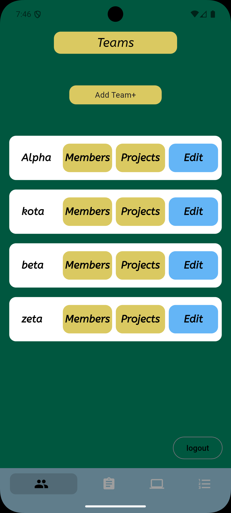
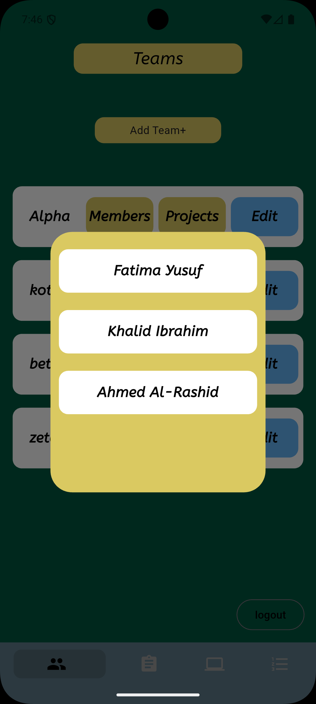
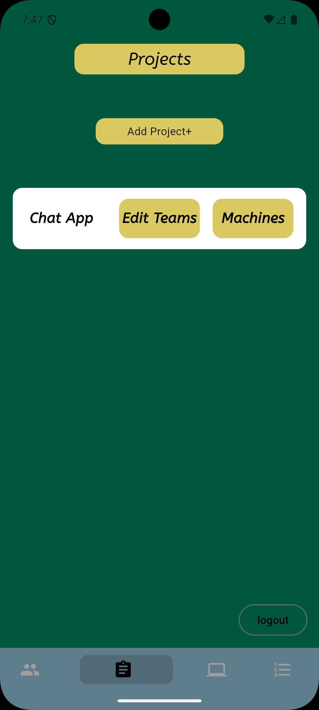
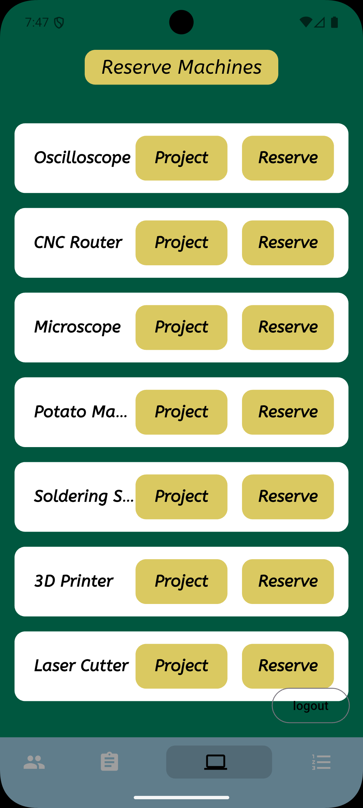
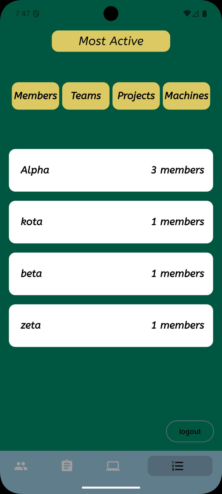

# Lab Resource Management System

A cross-platform Flutter mobile application for managing lab resources — teams, projects, and machines — with a real-time Firebase backend and an analytics dashboard.


---

## Overview

This app lets lab administrators and members coordinate teams, track projects, reserve machines, and surface usage analytics — all in real time. Admins get write access; regular members get a read-only view. Everything syncs through Cloud Firestore with no manual refresh required.

---

## Features

### Authentication
- Firebase email/password login with persistent auth state via `StreamProvider`
- Role-based UI: admin users see creation controls, members see data only

### Teams
- View all teams you belong to
- Admin: create teams, assign a leader, add members from the user pool
- Expand any team to inspect its member roster or linked project

### Projects
- Create and view projects with associated teams and reserved machines
- Projects are linked to machines at reservation time, maintaining bidirectional references

### Machine Reservation
- Browse all available machines
- Select a project to assign the machine to, then pick a start/end time with a datetime range picker
- **Conflict detection**: reservation is rejected if the selected time range overlaps any existing booking (checked with an inclusive interval comparison against Firestore)
- On success, both the machine record and the project record are updated; all affected providers are invalidated immediately so the UI reflects the new state

### Analytics Dashboard ("Most Active")
- Four ranked leaderboards: Members, Teams, Projects, Machines
- Rankings computed from live Firestore data, sorted descending by activity count
- Switching categories triggers a re-fetch from the relevant `FutureProvider`

---

## Architecture

The app follows an **MVC pattern layered on top of Riverpod 3.0**:

```
lib/
├── models/          # Plain Dart data classes (fromJson)
│   ├── user_model.dart
│   ├── team_model.dart
│   ├── project_model.dart
│   └── machine_model.dart
│
├── repositories/    # Firestore access — one class per domain
│   ├── auth_repository.dart
│   ├── user_repository.dart
│   ├── team_repository.dart
│   ├── project_repository.dart
│   ├── machine_repository.dart
│   └── analytics_repository.dart
│
├── controllers/     # Riverpod Notifier/AsyncNotifier — own all mutations
│   ├── auth_controller.dart
│   ├── teams_controller.dart
│   ├── projects_controller.dart
│   ├── reserve_machine_controller.dart
│   └── most_active_controller.dart
│
├── providers/
│   └── providers.dart   # FutureProviders + repository providers + auth state
│
├── views/           # Screens — call controller methods only, never repos directly
│   ├── auth/
│   ├── teams/
│   ├── projects/
│   ├── add_team/
│   ├── add_project/
│   ├── reserve_machine/
│   ├── most_active/
│   └── navigation_screen.dart
│
└── reusable_components/   # Shared UI widgets
```

**Data flow:**

```
View ──► Controller (Notifier) ──► Repository ──► Firestore
              │
              └──► ref.invalidate(provider)
                          │
                          └──► FutureProvider rebuilds ──► View re-renders
```

Views read from `FutureProvider`s and write through controller methods. Controllers own all `ref.invalidate()` calls after mutations so dependent providers stay consistent without manual refresh logic in the UI.

---

## Tech Stack

| Layer | Technology |
|---|---|
| UI framework | Flutter 3.x |
| State management | Riverpod 3.0 (`AsyncNotifier`, `Notifier`, `FutureProvider`, `StreamProvider`) |
| Backend | Firebase Auth + Cloud Firestore |
| Responsive layout | flutter_screenutil |
| Navigation | persistent_bottom_nav_bar |
| Date/time picking | omni_datetime_picker |
| Fonts | google_fonts |
| Vector assets | flutter_svg |

---

## Key Design Decisions

**Riverpod AsyncNotifier for controllers** — mutations live in `AsyncNotifier`/`Notifier` subclasses rather than being scattered across widgets. Each controller invalidates exactly the providers it affects, so the UI is always consistent without polling or manual `setState`.

**Conflict detection at the repository layer** — `MachineRepository.checkReserved` queries Firestore for all existing reservations of a machine and checks `newStart < existingEnd && newEnd > existingStart` before writing. The controller receives a `bool` and surfaces the result to the user without the view knowing anything about the storage logic.

**Role-based UI driven by data** — `currentUserObject` is a `FutureProvider` that fetches the logged-in user's Firestore record. Views watch it and conditionally render admin controls (e.g., "Add Team+") based on `user.status == 'admin'`, so access control is data-driven rather than hard-coded.

**Analytics computed at read time in Dart** — `AnalyticsRepository` fetches raw Firestore collections and computes rankings via group-by + sort rather than Firestore queries. Avoids composite index requirements and keeps the query logic simple and testable.

---

## Getting Started

### Prerequisites

- Flutter SDK `>=3.2.2`
- A Firebase project with **Authentication** (Email/Password) and **Cloud Firestore** enabled
- FlutterFire CLI: `dart pub global activate flutterfire_cli`

### Firebase credentials (not in git)

The following files are **gitignored** because they contain live API keys:

| File | Why excluded |
|---|---|
| `lib/firebase_options.dart` | Contains API keys for all platforms |
| `android/app/google-services.json` | Android Firebase config |
| `ios/Runner/GoogleService-Info.plist` | iOS Firebase config |
| `macos/Runner/GoogleService-Info.plist` | macOS Firebase config |

Every developer must regenerate them locally after cloning:

```bash
flutterfire configure
```

This command authenticates with Firebase, lets you select the project (`swe206-project`), and writes all four files automatically. You need the Firebase CLI installed and access to the Firebase project.

### Setup

```bash
# 1. Clone the repo
git clone <repo-url>
cd swe206_project

# 2. Install dependencies
flutter pub get

# 3. Generate Firebase config (required — see above)
flutterfire configure

# 4. Run
flutter run
```

### Firestore Collections

The app expects these top-level collections:

| Collection | Purpose |
|---|---|
| `users` | User profiles with `name`, `email`, `status` (`admin` or member) |
| `teams` | Team documents with `name`, `leader`, `members[]`, `project` |
| `projects` | Project documents with `name`, `leader`, `teams[]`, `machines[]` |
| `machines` | Reservation records with `name`, `startTime`, `endTime` (ISO 8601) |
| `existingMachines` | Catalog of machines available for reservation |

---

## Project Structure Highlights

- **Zero direct Firestore calls in views** — all Firestore access goes through repository classes; views only call controller methods
- **Shared widget library** in `reusable_components/` — `InfoContainer`, `TitleContainer`, `MembersContainer`, `InfoDialog`, and `CustomCircularProgressIndicator` keep UI consistent across screens
- **Responsive sizing** via `flutter_screenutil` throughout — `.w` / `.h` extensions on all dimensions
- **Auth state as a stream** — `authStateProvider` wraps `FirebaseAuth.instance.authStateChanges()` in a `StreamProvider<User?>`, so the app reacts immediately to login/logout without polling

---

## Screenshots








---

## License

For academic use — KFUPM SWE 206.
